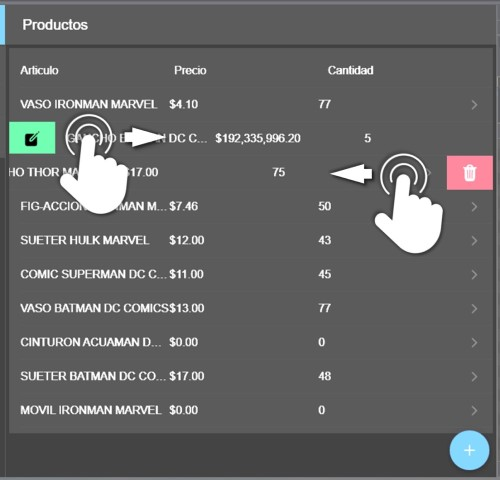

## Nota:
<table>
  <tbody>
    <tr>
      <td> </td>
      <td>Nota: los items dentro de la listas llevan funciones ocultas, las misma se muestran con el gesto que se muestra en la imagen</td>
    </tr>
  </tbody>
</table>

# instrucciones de despliegue

##### Requisitos previos:
 > haber desplegado el backend

##### comandos
una vez clonado el repositorio y situado en la carpeta del proyecto ejecutamos el siguiente comando para instalar todas las dependencias del proyecto

``````
	npm install
``````

luego actualizar los valores de urlServer, en el archivo ~/src/environments/environment.prod.ts y ~/src/environments/environment.ts 

``````javascript
export const environment = {
  production: true,
  urlServer: 'http://127.0.0.1:8080/api/'
};
``````

se debe reemplazar la linea http://127.0.0.1:8080/api/ con la url correspondiente al dominio donde se despliegue el backend

## Lanzar en modo de Desarrollo

Ejecute `ng serve` para un servidor de desarrollo. Vaya a `http://localhost:4200/`. La aplicación se recargará automáticamente si cambia alguno de los archivos de origen.


## lanzar a produccion

luego de debe compilar el proyecto con el siguiente comando

``````
ng build --prod
``````

esto genera una carpeta llamada "www" la cual debe ser colocada en el servidor en la carpeta public.


